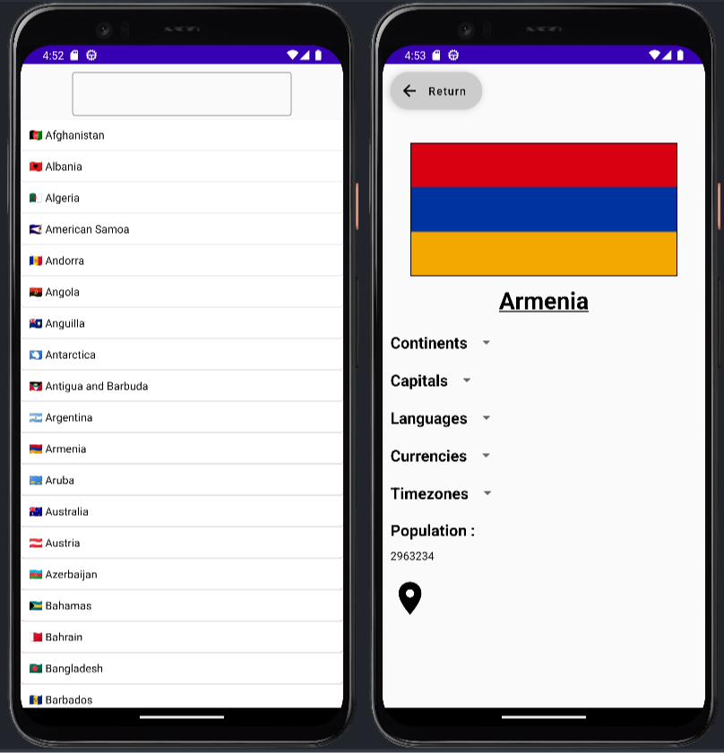
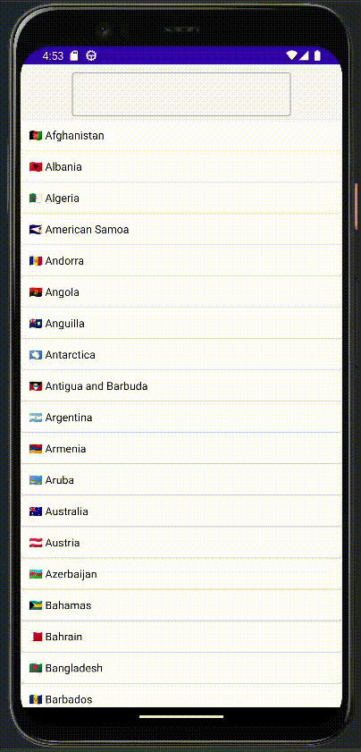

# **Kotlin101**

I coded this project as part of my training, to discover object-oriented programming (OOP).

Nous avons d

# Consignes

Le but du projet est de créer une application de Géographie dans laquelle nous avons listé les différents pays du monde et afficher les informations liés a chaque pays.

Pour ce faire, nous avons utilisé l'API [restcountries](https://restcountries.com/) qui nous fournira les informations néccessaire.

Le projet utilise une architecture [MVVM](https://fr.wikipedia.org/wiki/Mod%C3%A8le-vue-vue_mod%C3%A8le).

# Screenshots

# Démo

